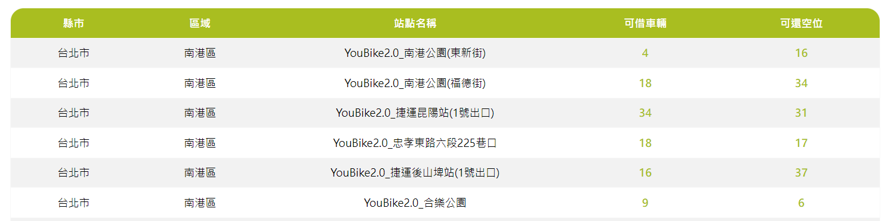

# Taipei-bike-spotter

## 簡介

Taipei-bike-spotter 是一個用於顯示台北市 YouBike 站點即時資訊的小作品。<br/>
利用台北市 YouBike 公開 API，讓使用者能夠方便地查詢各個站點的車輛數量與站點資訊。

## 功能

1. **即時站點資訊顯示**：顯示台北市所有 YouBike 站點的即時資訊，包括可借車輛數與可停空位數。

2. **城市搜尋輸入**：使用者可以透過搜尋輸入框來快速查詢特定站點資訊。

3. **行政區勾選**：使用者可以透過勾選不同的行政區來篩選顯示的站點。

4. **動態路由**：應用程式的頁面切換會根據點擊不同的頁眉連結來進行。


## 技術棧

- **前端框架**：React.js, Next.js
- **地圖 API**：台北市 YouBike 公開 API
- **版本控制**：Git, GitHub

## 安裝與使用

### 先決條件

- Node.js
- npm 或 yarn

### 安裝步驟

1. clone此存儲庫至本地
    ```bash
    git clone https://github.com/HSU0201/Taipei-bike-spotter.git
    ```

2. 進入專案目錄
    ```bash
    cd Taipei-bike-spotter
    ```

3. 安裝相依套件
    ```bash
    npm install
    ```

4. 啟動開發伺服器
    ```bash
    npm run dev
    ```

5. 在瀏覽器中開啟 http://localhost:3000 來查看應用程式

## 專案結構

```plaintext
Taipei-bike-spotter/
├── .github/              # GitHub 配置文件
├── .vscode/              # VS Code 配置文件
├── components/           # React 組件
├── data/                 # 資料處理
├── pages/                # Next.js 頁面
├── public/               # 靜態資源文件夾
├── styles/               # CSS 樣式
├── .eslintrc.json        # ESLint 配置文件
├── .gitignore            # Git 忽略文件
├── .prettierignore       # Prettier 忽略文件
├── .prettierrc.json      # Prettier 配置文件
├── jsconfig.json         # JavaScript 配置文件
├── next.config.js        # Next.js 配置文件
├── package-lock.json     # npm 鎖定文件
├── package.json          # 專案描述文件
└── README.md             # 專案說明文件
```
## 免責聲明

1. **品牌和商標**: 若本專案中提及的所有品牌、商標和服務標誌均為其相應所有者的財產。這些品牌、商標和服務標誌的使用僅為了在本專案中識別產品或服務，並不構成任何形式的支持、贊助或推薦。
2. **內容準確性**: 我們致力於確保本專案中提供的所有資訊和內容的準確性和完整性。然而，對於因資訊不準確或遺漏而導致的任何損失或損害，我希望能夠獲得理解和包容，並麻煩透過郵件告知相關訊息。
3. **外部連結**: 本專案可能包含指向第三方網站或服務的連結。這些連結僅為方便展示提供，並不意味著我對這些網站的內容、產品或服務進行任何形式的認可。我們對於由於使用或依賴這些網站的內容、產品或服務而引起的任何損失或損害希望您能夠理解。
4. **版權聲明**: 本專案的所有內容（包括但不限於文本、圖像、視頻和圖表）均受版權法保護。未經我明確許可，任何形式的轉載、修改、散佈或再利用均屬違法。
5. **更改通知**: 我們保留隨時修改本免責聲明的權利。請定期查看此頁面以獲取最新信息。

## 聯絡我

- 如果您對這些作品有任何問題或建議，請隨時通過GitHub或我的信箱與我聯絡。
- GitHub: [hsu0201](https://github.com/HSU0201)
- 信箱: [google mail](https://mail.google.com/mail/u/0/?fs=1&tf=cm&source=mailto&su=Hello+Ben,+From+Github&to=happymin0318@gmail.com)

感謝您的理解和支持。
